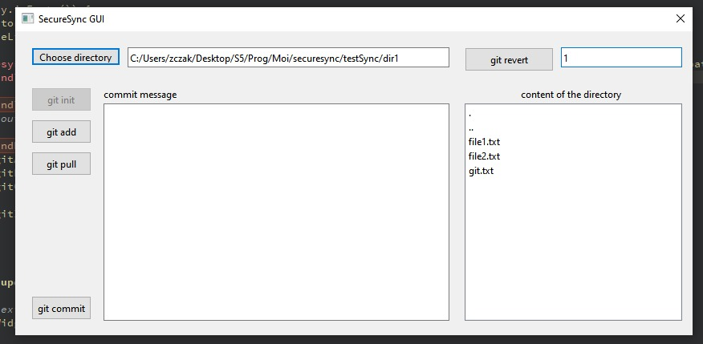

# SecureSync: Versioned File Synchronization Tool

SecureSync is a comprehensive file synchronization tool with version management capabilities. It is built using C++ as the primary programming language, the Qt framework for the graphical user interface (GUI). This project also incorporates robust security measures.

## Features

- **User-Friendly GUI**: A clean and intuitive interface using Qt widgets for easy navigation.
- **Local File Synchronization**: Core functionality for selecting folders, comparing file versions, and updating files locally.
- **Version Management**: Keep track of changes, timestamps, and user modifications, allowing users to roll back to previous file versions.
- **Secure Authentication**: Integration of a secure login system with hashed and securely stored passwords.
- **Error Handling and Logging**: Implement mechanisms to handle network issues, file conflicts, and a logging system to track synchronization activities and errors.

## Getting Started

Follow these instructions to get a copy of the project up and running on your local machine.

### Prerequisites

- C++ development environment with Qt installed.

### Installation

1. Clone the repository: ```git clone https://github.com/zakariaCHOUKRI/securesync.git```

### Running the Code

#### CLI

Make the `compile.sh` script executable:
```
chmod a+x ./compile.sh
```

Run the compiled program: ```./myProgram```
```
./myProgram.exe
```

#### GUI

To run the QT interface, go to QT Creator, click open project, and choose the file `CMakeLists.txt` inside the `gui` folder. Then build the project and run it.

## Usage

### CLI

To interact with SecureSync, use the following commands in the command line interface:

Available commands:
- `git login` - Log in with email and password
- `git add` - Add files to staging
- `git commit` - Commit staged files
- `git register` - Create a new account
- `git init` - Initialize the repository
- `git pull` - Pull changes from last version
- `git revert` - Revert to a specific version

### GUI

The GUI offers everything that the CLI has to offer but with a beautiful interactive interface.




## Testing

In order to run all unit tests, run the CLI and use the following command:
```
$ test
```

## Documentation

1. [Presentation](./Presentation.pptx)
2. [Report (pdf)](./finalReport.pdf)
3. [Report (docx)](./finalReport.docx)

## Authors

- [Omar Alfarouq Bouhadi](https://github.com/tweizy)
- [Zakaria Choukri](https://github.com/zakariaCHOUKRI)
- [Ayman Youss](https://github.com/AymanYouss)

